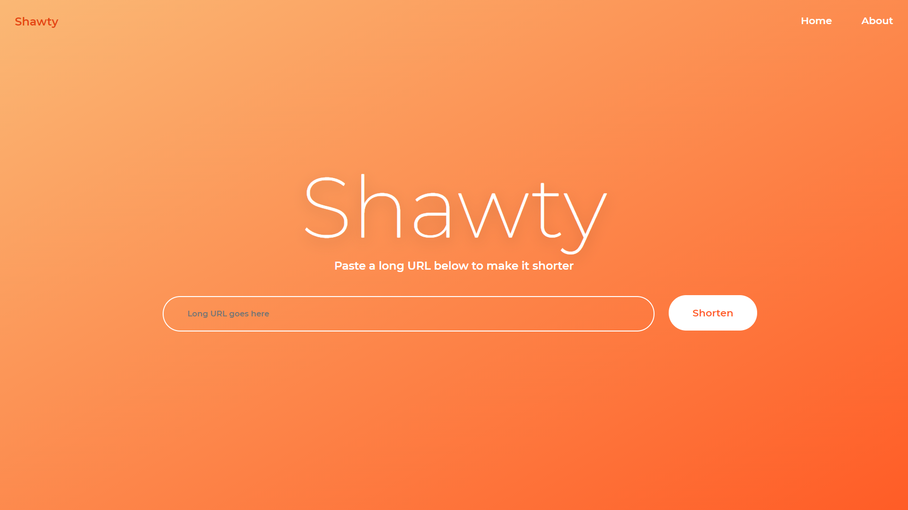
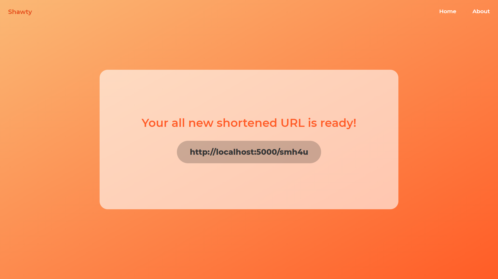

# SHAWTY - URL Shortening Flask Web App

"Shawty" is a very basic URL shortening web application built as a practice mini project for getting familairised with working in Flask.

## Technologies used:
- **Frontend**
   1. HTML5
   2. CSS3
- **Backend**
   1. Flask (Python)

## Screenshots:

